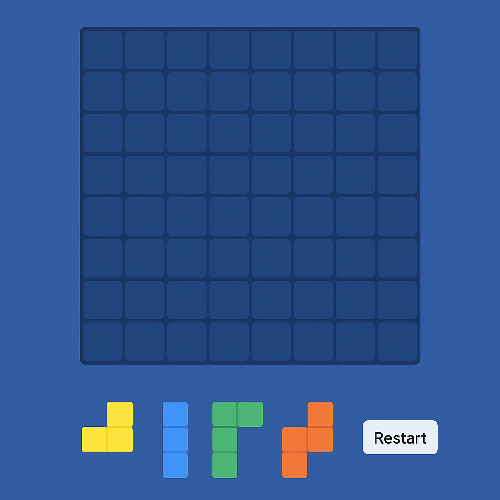

Elevator pitch: Stack Tactics is a strategic block game where players drag and drop different shaped blocks into a 8x8 grid.
This game offers a level system where you are required to clear the board with a given set of pieces. 
The game is easy for beginners to start playing but hard to master with the complex levels that require
lots of planning and strategy. Quick to play, relaxing to look at, and endlessly satisfying 
everytime a row or column disappears.

Synopsis: A grid based puzzle game with an 8x8 board and different block shapes
Objective - use all pieces given and end with the board cleared to complete the level
Core mechanics - drag and drop blocks into place
               - rows and columns clear once they are full
               - fail if no legal moves remain or you are out of blocks and the board is not clear

